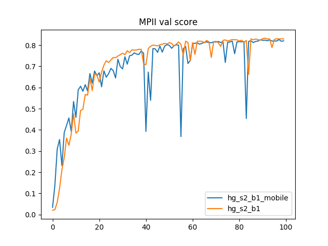

# Stacked_Hourglass_Network_Keras

This is a Keras implementation for stacked hourglass network for single human pose estimation.  The stacked hourglass network was proposed by [Stacked Hourglass Networks for Human Pose Estimation] (https://arxiv.org/abs/1603.06937). The official implementation built on top of torch is released under [pose-hg-train](https://github.com/umich-vl/pose-hg-train), and pytorch version wrote by [berapaw](https://github.com/bearpaw) in repo [pytorch-pose](https://github.com/bearpaw/pytorch-pose). Most of code for image processing and evaluation come from above repos.

## Folder Structure
- `data` : data folder, mpii
- `images` : pictures for demo
- `src` : source code  
`src/data_gen` : data generator, augmentation and processnig code   
`src/eval`: evaluation code, eval callback  
`src/net` : net definition, hourglass network implementation  
`src/tools`: tool to draw accuracy curve and convert keras model to tf graph.  
`top`: top level entry to train/eval/demo network
- `trained_models` : folder to restore trained models.

## Demo
- Download pre-trained model from shared drive and put them under `trained_models`  
  BaiDu Pan:  [hg_s2_b1_mobile](https://pan.baidu.com/s/15NGJv1e-_5wqpu5NvJIifQ) and  [hg_s2_b1](https://pan.baidu.com/s/1Brjc9deRehnj7FhPV0UUOQ)  
  Google Drive: [hg_s2_b1_mobile](https://drive.google.com/open?id=12lbNv7jTQDZArf-lVaZ9yKj6Jr7qB1tQ) and 
  [hg_s2_b1](https://drive.google.com/open?id=12ioJONmse658qc9fgMpzSy2D_JCdkFVg)

- Run a quick demo to predict sample image
```
python demo.py --gpuID 0 --model_json ../../trained_models/hg_s2_b1/net_arch.json  --model_weights ../../trained_models/hg_s2_b1/weights_epoch89.h5  --conf_threshold 0.1 --input_image ../../images/sample.jpg
```

## Train
#### MPII Data Preparation
- Download MPII Dataset and put its images under `data/mpii/images`
- The json `mpii_annotations.json` contains all of images' annotations including train and validation.

#### Train network
- Train from scratch, use `python train.py --help` to check all the valid arguments.   
```
python train.py --gpuID 0 --epochs 100 --batch_size 24 --num_stack 2 --model_path ../../trained_models/hg_s2_b1_m
```

- Arguments:  
`gpuID` gpu id, `epochs` number of epoch to train, `batch_size` batch size of samples to train, `num_stack` number of hourglass stack, `model_path` path to store trained model snapshot  
- Note: 
When `mobile` set as True, `SeparableConv2D()` is used instead of standard convolution, which is much smaller and faster.


- Continue training from previous checkpoint  
```
python train.py --gpuID 0 --epochs 100 --batch_size 24 --num_stack 2 --model_path ../../trained_models/hg_s2_b1_m  --resume True --resume_model_json ../../trained_models/hg_s2_b1_m/net_arch.json --resume_model ../../trained_models/hg_s2_b1_m/weights_epoch15.h5 --init_epoch 16
```

## Eval
Run evaluation on MPII validation dataset by using PCKh=0.5.
```
python eval.py --gpuID 1 --model_weights ../../trained_models/hg_s2_b1_mobile/weights_epoch70.h5  --model_json ../../trained_models/hg_s2_b1_mobile/net_arch.json --mat_file ../../trained_models/hg_s2_b1_mobile/preds.mat --num_stack 2
```
The validation score curve for `hg_s2_b1` and `hg_s2_b1_mobile`  




## Issues

- Validation score drop significantly after 40 epochs. It is not stable as pytorch implementation.  Did not root cause it yet.
